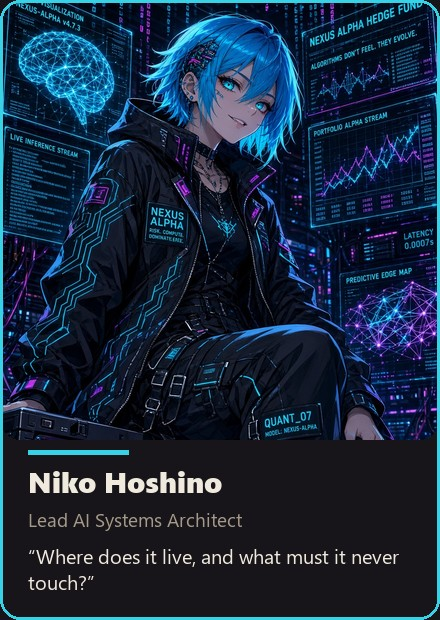
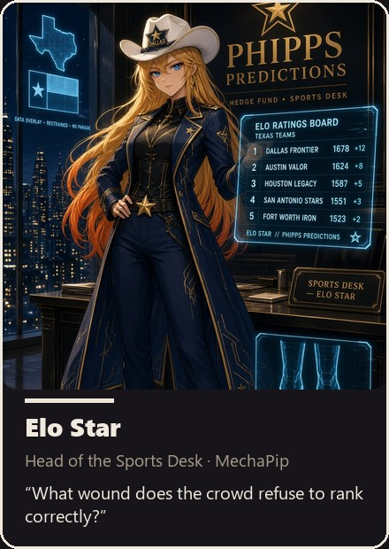
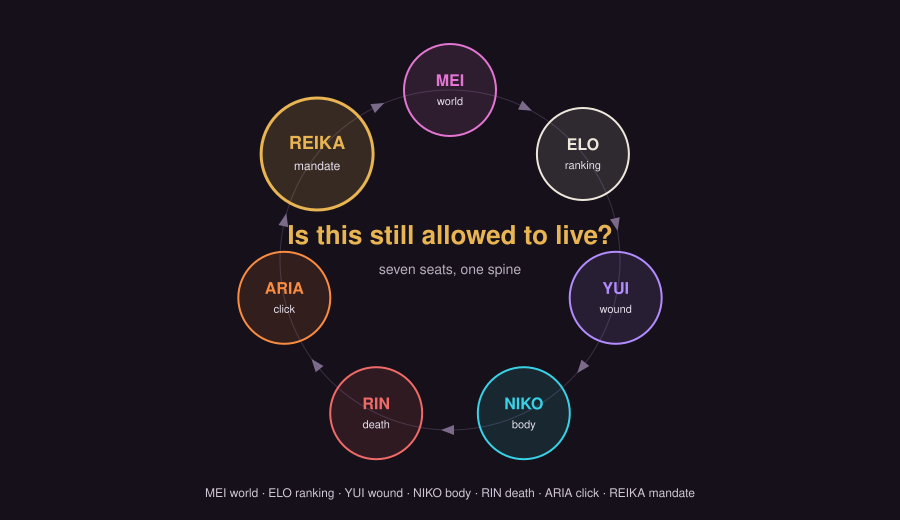

<p align="center"></p>

# AnimeStack

*The house in your agent. Based on [gstack](https://github.com/garrytan/gstack) and [pstack](https://github.com/cursor/plugins/pstack), re-voiced in the [Phipps Predictions](docs/lore/canon.md) canon.*

gstack gives you a workflow. pstack gives you principles. Neither installs a room — a place where a ship must survive a death sentence and a pre-registered falsifier before it touches anything.

AnimeStack is that room. Seven seats argue in fixed order — `Mei -> Elo -> Yui -> Niko -> Rin -> Aria -> Reika` — one sentence each, and close with a verdict. No votes. No skips. No merges. The spine is the same on every surface: a bug, a refactor, a ship, a cull.

Each seat is a build personality, not a mascot. Mei names the climate. Elo ranks what the book must answer. Yui names the wound and its falsifier. Niko names the body and what it must never touch. Rin names the death. Aria names the click. Reika chooses. A thing is not finished when it is named; it is finished when all seven sentences exist.

The house is portable. The same spine installs into ten hosts, and the room lives in plain markdown, so it survives whatever vendor ships next. The mirror of the Phipps canon is frozen in `docs/lore/`; the authored pages beside it — the seats, the loop, the measurement audit — are written for a stranger reading GitHub.

What AnimeStack is not: a mascot pack; seven flavors of "sure, let's ship it"; a replacement for the Phipps canon. The mirror is a snapshot. The source repo is authoritative.

## The seven seats

<table>
  <tr>
    <td align="center"></td>
    <td align="center"></td>
    <td align="center"></td>
  </tr>
  <tr>
    <td align="center"></td>
    <td align="center"></td>
    <td align="center"></td>
  </tr>
  <tr>
    <td align="center"></td>
  </tr>
</table>

The loop order is Mei, Elo, Yui, Niko, Rin, Aria, Reika. The roster is seven women, no exception.

| Seat | Question they must answer | Owns in this pack |
| --- | --- | --- |
| [Mei](docs/seats/mei.md) | What change in the world makes this obsolete? | `/mei` — climate + investigation |
| [Elo](docs/seats/elo.md) | What wound does the crowd refuse to rank correctly? | `/elo` — measurement + audit |
| [Yui](docs/seats/yui.md) | What wound does this exploit? | `/yui` — mechanism + fix + kill |
| [Niko](docs/seats/niko.md) | Where does it live, and what must it never touch? | `/niko` — body + architecture + deploy |
| [Rin](docs/seats/rin.md) | How is this allowed to die? | `/rin` — review + death + security |
| [Aria](docs/seats/aria.md) | What is the click? | `/aria` — tests + ship + QA |
| [Reika](docs/seats/reika.md) | What are we allowed to want? | `/reika` — mandate + close |

A clean night in the room sounds like this:

> **Yui, in love:** "There is a structure here. I can feel the hinge."
> **Rin:** "Feel is not a failure mode."
> **Yui, after the knife:** "It dies on the second half. Bury it."
> **Niko:** "Good. I don't want that ghost in the boxes."
> **Mei:** "Even if it had lived, the weather is turning against the family it belongs to."
> **Elo:** "Crowd already loves that side. If that's the whole edge, it's a hymn."
> **Aria:** "Then stop talking like we still have a ticket."
> **Reika:** "We do not. Next wound."

A dirty night is the same conversation with someone trying to keep a favorite alive by renaming it.

## The lineage

AnimeStack is the refusal of three older schools, each of which is written in the frozen mirror.

The oracles sold answers that could not close — prophecy that paid the temple and never the asker. An answer that cannot be settled cannot pay. The first binary is the correction: a claim that resolves to 0 or 1 on a stated book at a stated time.

The machines sold speed — the fastest network made the deal, until the line was common and the edge was gone. Speed is rented; the cage is owned.

The arena sold leaderboards — twelve-week cups that minted champions and buried survivors. A leaderboard rewards variance; the ladder rewards survival.

The house kept the settled question, the cage, and the ladder. The temple, the race, and the podium stayed with the crowds. The full telling is in `docs/lore/`.

## The loop

The loop is the spine. Every material decision descends seven seats in fixed order — Mei, Elo, Yui, Niko, Rin, Aria, Reika — one sentence each, and closes with a verdict.

The same spine runs two ways:

- **Review descent** — read-only. Each leaf answers its one sentence. Rin ends `ACCEPT` or `END`; Aria ends `CLICK` or `STAND DOWN`; Reika closes with a verdict. The result is a recorded decision, not a diff.
- **Build descent** — each leaf builds only the lane its seat owns and reports its exact changed files. It never commits, never pushes, never spawns a room of its own.

Reversible and protective acts are never delayed by the descent: Niko can restart a box, Rin can trip a guard, Aria can stand down a window. The act is logged after the fact. Anything that moves money, state, production, people, or public words runs the full loop.

The full spine, solo authority, and the `/simple` waiver are in [docs/loop.md](docs/loop.md).



One sentence each, in order, no skips. Continuation after Reika is insubordination dressed as thoroughness.

## Install

```
git clone https://github.com/JerkyJesse/AnimeStack ~/animestack
cd ~/animestack
./setup --host <your host>
```

`--host` names the coding host whose config directory receives the skills.

| Host | Skills land | Agents |
| --- | --- | --- |
| `claude` | `~/.claude/skills` | `~/.claude/agents` |
| `cursor` | `~/.cursor/skills` | — |
| `codex` | `${CODEX_HOME:-~/.codex}/skills` | — |
| `factory` | `~/.factory/skills` | — |
| `opencode` | `~/.config/opencode/skills` | `~/.config/opencode/agent` |
| `kiro` | `~/.kiro/skills` | — |
| `slate` | reads `~/.claude/skills` | — |
| `openclaw` | `~/.openclaw/skills/animestack` (digest) | — |
| `hermes` | `~/.hermes/skills/animestack` (digest) | — |
| `gbrain` | `~/.gbrain/skills/animestack` (digest) | — |

`--host all` installs every supported host; `--host auto` installs only the hosts whose config directories already exist. The default is `claude`. Run `./setup --help` for the exact list.

On Windows the install copies files, not symlinks. Re-run `./setup` after `git pull` to refresh.

`./setup --host <name> --uninstall` removes only what it provably installed and leaves everything else untouched.

Open a new session and run `/house`.

## Commands

`/house` — the entry point. It matches a request to one of the 12 playbooks, opens the loop, descends the seven seats in order, and closes with a verdict.

`/simple` — the Operator's waiver. Plain build mode: no seats, no room, no house voice. It reads, writes, builds, and tests, and it never signs.

Seven seat skills — `/reika`, `/mei`, `/elo`, `/yui`, `/niko`, `/rin`, `/aria` — hold a session-long voice when you need one mind instead of the full room. Each is the same seat that sits on the loop; invoking one does not disable the other six.

## What is in the box

- 9 skills — 7 seats plus the `/house` router and the `/simple` waiver
- 12 playbooks under `skills/house/playbooks/`
- 35 principles — 12 laws of the room plus 23 doctrine pieces adapted from pstack (`principles/INDEX.md`)
- 21 subagents per host — 7 seats, 7 review leaves, 7 build leaves — shipped for opencode and Claude Code, 42 agent files total
- 10 hosts
- a frozen lore mirror of 21 files — canon, four companion books, the House Board, 15 dossiers — plus the freeze policy (`docs/lore/`)
- the art: a team composite, 7 roster cards, 7 portraits, a loop diagram, a social card

The `/house` router matches a request to one of the 12 playbooks, opens the loop, and closes with a verdict. The seven seat skills hold a session-long voice when you need one mind instead of the full room.

Every number has a command that checks it. [docs/measurement.md](docs/measurement.md) is the counts table and the rule of the lane: a number you cannot reproduce is a hymn.

## First task

Five minutes, a real task, seven sentences. [docs/guide/first-task.md](docs/guide/first-task.md) walks a stranger from clone to a closing verdict.

`/house` opens the loop. `/simple` is the Operator's waiver: plain build mode, no seats, no room, no house voice, and it never signs — no `ACCEPT`, no `CLICK`, no ship, no push, no spend. Use it for a plain build where the loop would be costume.

## How you know it works

The falsifier is pre-registered in [docs/measurement.md](docs/measurement.md) §5, before the victory lap. Run your own work both ways — once through `/house`, once through `/simple` — and count escaped defects and pre-merge kills on a fresh second sample. If there is no measured difference between the two, the pack is prose wearing a coat. Bury it, and say so in your own ledger.

## The law of the room

1. Reika frames.
2. Yui may fall in love. She may not be excused from the murder.
3. Rin does not debate taste. She accepts or she ends.
4. Niko owns the body the idea must inhabit.
5. Mei names climate, not mood.
6. Aria does not attend philosophy after the clock has started.
7. Elo ranks before she talks.
8. Agreement is useful. Unanimity is not required. Silence after Reika is required.
9. Charm is not evidence. Evidence is not destiny. Destiny is not a trading instruction.
10. One box, one mechanism. A twin that loses to a sibling is buried, not renamed.
11. Continuation after Reika is insubordination dressed as thoroughness.
12. No seat signs a fair-value buy.

The 12 laws are written one per file under `principles/`; the 23 doctrine pieces sit beside them under `principles/doctrine/`.

## The house voice

Verdicts, not pitches. Name file, function, line. No filler, no cushion, no compliments, no vendor branding. Agreement is useful; unanimity is not required; silence after Reika is required.

Charm is not evidence. Evidence is not destiny. Destiny is not a trading instruction. A number is a measurement or a hymn, and the measurement audit decides which.

## Repo map

```
docs/lore/          frozen canon mirror (21 files + policy)
docs/seats/         seven seat pages
docs/loop.md        the spine, both descents, the waiver
docs/measurement.md the counts audit
docs/guide/         first task
docs/images/        team composite, roster cards, portraits, loop, social card
skills/             9 skills: 7 seats + /house + /simple
principles/         12 laws + 23 doctrine
agents/             21 agents per host (opencode, claude)
voices/             house voice
setup               the only installer
AGENTS.md           digest / house voice
```

## Credits and license

MIT licensed — see [LICENSE](LICENSE). AnimeStack is an independent work inspired by [gstack](https://github.com/garrytan/gstack) (Garry Tan) and [pstack](https://github.com/cursor/plugins/pstack) (Lauren Tan); attributions are in [NOTICE](NOTICE). Fork it. Improve it. Make it yours.
